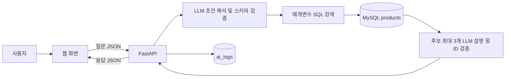

# Food Commerce AI Assistant

식품 이커머스 고객의 자연어 질문을 검색 조건으로 변환하고, **MySQL의 실제 상품과 FAQ를 근거로 답변하는 로컬 AI 웹 서비스**입니다.

개인 학습·포트폴리오 프로젝트이며 가상 상품 30개와 가상 FAQ 10개를 사용합니다. 상품 조건 검색, Gemini 추천 설명, FAQ 답변, 요청 로그와 HTML/CSS/JavaScript 화면을 구현했습니다. 배포 및 실제 고객 운영은 범위에 포함하지 않습니다.

[시스템 구조](docs/architecture.md) · [ERD](docs/erd.md) · [검증·문제 해결](docs/evaluation/product-validation.md) · [프로젝트 설명](docs/project-summary.md) · [제출 전 확인](docs/release-checklist.md)

## 해결하려는 문제

“선물용인데 너무 달지 않고 개별포장된 상품”처럼 여러 조건을 함께 요청할 때, 조건에 맞는 상품과 이유를 확인할 수 있도록 합니다. 배송·보관 질문에는 등록된 FAQ를 찾아 답변과 원문 출처를 제공합니다.

LLM은 질문 해석과 설명 생성을 맡습니다. 검색 조건과 상품 조회는 검증된 Python 로직 및 매개변수 SQL로 처리합니다. 모델 출력으로 DB의 상품명·가격을 덮어쓰지 않으며, 후보 밖 ID나 잘못된 FAQ 출처는 거절합니다. 이 검사가 생성 문장 전체의 사실성을 보장하지는 않습니다.

## 주요 기능

| 기능 | 현재 동작 |
| --- | --- |
| 상품 데이터 | pandas로 CSV의 누락·중복·범위·허용값 검사 후 MySQL 저장 |
| 자연어 조건 검색 | 선물 가능, 개별포장 포함/제외, 당도 상한, 최소/최대 가격, 가격 정렬 |
| 추천 이유 | SQL 검색 결과 앞 3개에만 LLM 설명 추가, 전체 검색 결과는 유지 |
| FAQ AI | 키워드로 최대 3개 근거 검색, 답변과 클릭 가능한 원문 출처 표시 |
| 불확실한 요청 | 미지원 조건·모호한 조건·FAQ 근거 없음·동점은 안내 또는 답변 보류 |
| 오류 대응 | 503에만 1초 뒤 1회 재시도, 실패 시 안전한 대체 응답 |
| 요청 로그 | 요청 ID, 질문, 응답 JSON, 처리 시간, 상태, 오류 코드를 MySQL에 저장 |

가성비는 **판매가격 오름차순**으로 정의합니다. 중량·품질 대비 가치나 개인화 순위를 계산하지 않습니다. “너무 달지 않은”은 가상 당도 2 이하이며 영양정보나 건강 적합성을 뜻하지 않습니다.

## 기술과 데이터 흐름

Python · FastAPI · Pydantic · MySQL/PyMySQL · pandas · Gemini REST API · python-dotenv · HTML/CSS/JavaScript



상품과 FAQ의 분기 및 오류 흐름은 [시스템 구조](docs/architecture.md), 테이블 관계는 [ERD](docs/erd.md)에 정리했습니다. 벡터 DB는 사용하지 않습니다. 작은 구조화 상품 데이터에는 SQL, 공통 FAQ에는 키워드 검색을 적용했습니다.

## 로컬 실행: Windows PowerShell

프로젝트 루트에서 실행합니다. 기존 `.venv`가 있으면 환경 생성은 생략합니다.

### 1. Python 환경과 패키지

```powershell
python -m venv .venv
.\.venv\Scripts\python.exe -m pip install -r requirements.txt
```

`python` 명령을 찾지 못하면 설치한 Python 실행 경로를 사용합니다. Python Launcher가 등록된 환경에서는 `py -m venv .venv`도 사용할 수 있습니다. 실제 검증 환경과 범위는 [제출 전 확인](docs/release-checklist.md)을 참고하세요.

### 2. 환경변수

`.env.example`을 참고해 프로젝트 루트에 `.env`를 만듭니다. 기존 `.env`를 덮어쓰지 마세요.

```dotenv
DB_HOST=127.0.0.1
DB_PORT=3306
DB_NAME=food_commerce
DB_USER=your_db_user
DB_PASSWORD=your_local_password
GEMINI_API_KEY=your_api_key
LLM_ENABLED=true
LLM_QUERY_ENABLED=true
LLM_FAQ_ENABLED=true
LLM_MODEL=gemini-3.5-flash-lite
LLM_FAQ_MODEL=gemini-3.5-flash-lite
```

DB 계정은 본인 로컬 계정으로 설정합니다. 키와 비밀번호는 Git에 올리지 않습니다. 현재 모델 선택은 실제 검증에 사용한 설정이며 사용 가능 여부와 할당량은 계정·시점에 따라 달라질 수 있습니다. `.env` 변경 후 서버를 재시작합니다.

키 없이 구조를 확인하려면 `LLM_ENABLED=false`로 설정합니다. 이 모드에서는 제한된 단순 규칙 검색과 FAQ 원문 조회만 가능하며, 자연어 가격 조건 해석이나 AI 설명은 제공하지 않습니다.

### 3. MySQL 테이블과 가상 데이터

MySQL 서버를 실행하고 Workbench에서 [sql/schema.sql](sql/schema.sql)을 실행합니다. 이 파일은 `food_commerce` DB와 `products` 테이블을 만듭니다. 다른 DB 이름을 쓸 경우 SQL과 `.env`를 함께 맞춰야 합니다.

```powershell
.\.venv\Scripts\python.exe -m scripts.init_products --check-only
.\.venv\Scripts\python.exe -m scripts.init_products
.\.venv\Scripts\python.exe -m scripts.init_faq
.\.venv\Scripts\python.exe -m scripts.init_logs
```

상품은 30개, FAQ는 10개입니다. 동일 상품 재입력은 건너뛰며 기존 ID의 내용이 다르면 저장을 중단합니다. FAQ 초기화도 기존 ID를 덮어쓰지 않습니다. 기존 DB에 데이터를 추가하는 초기화이며, 테이블 구조 변경을 처리하는 마이그레이션 도구는 아닙니다.

`sql/seed_products.sql`은 초기 5개 상품 학습 자료입니다. 위 CSV 입력 과정과 함께 실행할 필요가 없습니다.

### 4. 서버 실행

```powershell
.\.venv\Scripts\python.exe -m uvicorn app.main:app --reload
```

- 웹 화면: http://127.0.0.1:8000/
- API 문서: http://127.0.0.1:8000/docs
- 상품 데이터: http://127.0.0.1:8000/api/products
- 종료: 서버 터미널에서 `Ctrl+C`

HTML 파일을 직접 열지 않고 FastAPI 주소로 접속합니다. `/health`는 HTTP 응답 확인용이며 DB·LLM 상태를 검사하지 않습니다.

## 사용 예시

| 질문 | 정상 해석 시 30개 데이터의 기대 결과 |
| --- | --- |
| 선물용인데 너무 달지 않고 개별포장된 상품 추천해줘 | 7개: ID 1·5·12·18·20·26·30 |
| 가성비 있는 상품을 추천해줘 제일 싼 상품도 포함해서 | 가격 오름차순, 첫 상품 미니 쌀과자 4,500원 |
| 2만원 이하 상품 중 개별포장은 제외해줘 | 5개: ID 7·9·11·21·23 |
| FAQ: 배송비 | 생성 성공 시 기본 3,000원·50,000원 이상 무료라는 가상 정책과 faqs:2 출처 |
| FAQ: 배송 | 동점 근거에 따른 질문 구체화 안내 |

LLM 결과와 외부 API 상태는 실행 시점에 따라 달라질 수 있습니다. [화면 캡처 안내](docs/demo-guide.md)에 시연 순서와 확인할 항목을 정리했습니다. 최신 화면 캡처는 아직 저장하지 않았습니다.

## API

| 메서드 | 경로 | 역할 |
| --- | --- | --- |
| GET | `/` | 웹 화면 |
| GET | `/health` | HTTP 상태 확인 |
| GET | `/hello?name=민수` | 초기 학습용 인사말 |
| GET | `/api/products` | 활성 상품 조회 |
| POST | `/api/recommendations` | 조건 해석·상품 검색·추천 이유 |
| POST | `/api/faq/search` | FAQ 근거 검색·답변·원문 출처 |

POST 본문 예시: `{"query":"2만원 이하 상품 중 개별포장은 제외해줘"}`. 질문은 공백 제거 후 1~500자로 검사합니다. 공백 입력은 HTTP 422, DB 조회 오류는 HTTP 503으로 반환합니다.

추천 응답에는 `request_id`, `conditions`, `count`, `products`, `interpretation`, `llm`이 포함됩니다. FAQ 응답에는 `mode`, `status`, `answer`, `sources`, `matches`, `llm` 등이 포함됩니다. 생성 성공은 `mode=generated`, 생략·실패는 `retrieval_only`입니다.

## 오류 처리와 로그

| 실패 위치 | 처리 |
| --- | --- |
| 상품 조건 해석 | 단순한 문장 전체를 인식할 수 있을 때만 규칙 적용. 복잡한 조건은 검색을 멈추고 안내 |
| 추천 설명 | 이미 조회한 DB 상품을 설명 없이 반환 |
| FAQ 답변 | 검색된 원문 유지. 모델이 근거 부족을 표시하면 답변 보류 |
| DB 조회 | 일반화한 503 메시지와 서버 로그, 요청 ID 제공 |
| 로그 DB 저장 | 콘솔에 오류를 남기고 원래 응답 유지. 영구 저장은 보장하지 않음 |

상품 요청은 조건 해석·이유 생성의 최대 2단계입니다. 각 단계에서 503 재시도 1회를 허용하므로 외부 호출은 최대 4회, FAQ는 최대 2회입니다. 429·인증 오류·잘못된 출력은 재시도하지 않습니다. 브라우저 대기 한도는 상품 120초, FAQ 60초이며 서버 작업 취소를 보장하지 않습니다.

추천·FAQ 엔드포인트에 진입한 요청을 `ai_logs`에 기록합니다. 입력 검증에서 거절된 422 요청과 GET 요청은 DB 로그 범위 밖입니다.

```sql
SELECT request_id, feature, status, error_code, latency_ms, created_at
FROM food_commerce.ai_logs
ORDER BY log_id DESC
LIMIT 10;
```

`created_at`은 UTC입니다. `latency_ms`는 함수 진입부터 응답 준비까지로 로그 쓰기와 네트워크 시간을 제외합니다. 화면 요청 ID로 DB 기록을 찾을 수 있습니다. 로그에는 질문과 답변이 저장되므로 개인·민감정보를 입력하지 않는 가상 데모로 사용합니다.

## 검증과 문제 해결

| 검증 | 기록된 결과 | 범위 |
| --- | --- | --- |
| 자동 테스트 | 60개 통과 | 외부 API와 DB를 모의 처리한 로직·예외 검증 |
| 실제 MySQL 검색 | 15/15 통과 | 고정 조건의 상품 ID·정렬 순서 |
| 실제 자연어 HTTP 요청 | 3/3 통과 | 실제 LLM·DB·요청 로그 포함, 고정 질문 단일 실행 |

```powershell
.\.venv\Scripts\python.exe -B -m unittest discover -s tests -q
.\.venv\Scripts\python.exe -m scripts.evaluate_products
# 실행 중인 서버로 실제 AI 요청 3개를 보내며 API 할당량을 사용합니다.
.\.venv\Scripts\python.exe -m scripts.evaluate_products --live
```

실제 DB 평가는 제공 CSV와 동일한 30개 상품을 전제로 합니다. 위 결과는 일반 자연어 정확도 100%를 의미하지 않습니다.

실제 검증에서 API 503/시간 초과와 “추천”을 미지원 조건으로 분류하는 문제를 구분했습니다. 모델 비교 후 프롬프트에 요청 동사와 상품 조건의 구분을 추가했고, 같은 모델의 고정 질문 검증이 2/3에서 3/3으로 바뀌었습니다. 실패 원본을 포함한 [문제 해결 기록](docs/evaluation/product-validation.md)을 공개합니다. 개발에 사용한 질문을 재검증한 결과이며 별도 평가셋의 정확도나 속도 개선률로 주장하지 않습니다.

## 파일 구조

```text
app/             # FastAPI, DB 접근, 조건 해석, LLM 호출, FAQ 검색, 로그
scripts/         # 데이터 초기화, 연결 확인, 고정 평가
data/            # products.csv / faqs.json (모두 가상 데이터)
sql/             # products / faqs / ai_logs 테이블 정의
templates/       # HTML 화면
static/          # CSS / JavaScript
tests/           # 자동 테스트
docs/            # ERD, 구조도, 학습 안내, 검증 결과, 개발 기록
.env.example     # 비밀정보 없는 환경변수 예시
requirements.txt # 검증 환경의 고정 패키지 버전
```

[상품 데이터 안내](docs/product-data-guide.md) · [자연어 검색 안내](docs/natural-language-search-guide.md) · [FAQ AI 안내](docs/faq-ai-guide.md) · [로그 안내](docs/request-logs-guide.md) · [개발 기록](docs/development_log.md)

## 한계와 향후 개선

- 가상 데이터 기반 로컬 MVP로 실제 매출·고객 만족도·대규모 트래픽 개선 효과는 측정하지 않았습니다.
- 카테고리·보관방법·중량·알레르기·배송 조건은 현재 상품 자연어 필터가 지원하지 않습니다.
- FAQ 검색은 키워드 기반이며 부정문·복합 질문에서 오탐할 수 있습니다. 상품별 FAQ 컬럼은 있지만 현재 공통 FAQ만 사용합니다.
- 상품·출처 ID 검사만으로 생성 문장의 사실성을 완전히 보장할 수 없습니다.
- 외부 API 장애, 할당량, 모델 변경에 영향을 받습니다. 인증·접속 제한·로그 보존 정책 등 실제 운영 요건은 추가 설계가 필요합니다.
- 향후 별도 평가 질문 확장, FAQ 검색 개선, 반복 측정과 설명 문장 검토를 진행할 수 있습니다. 리뷰 분석은 이번 MVP에 포함하지 않았습니다.
