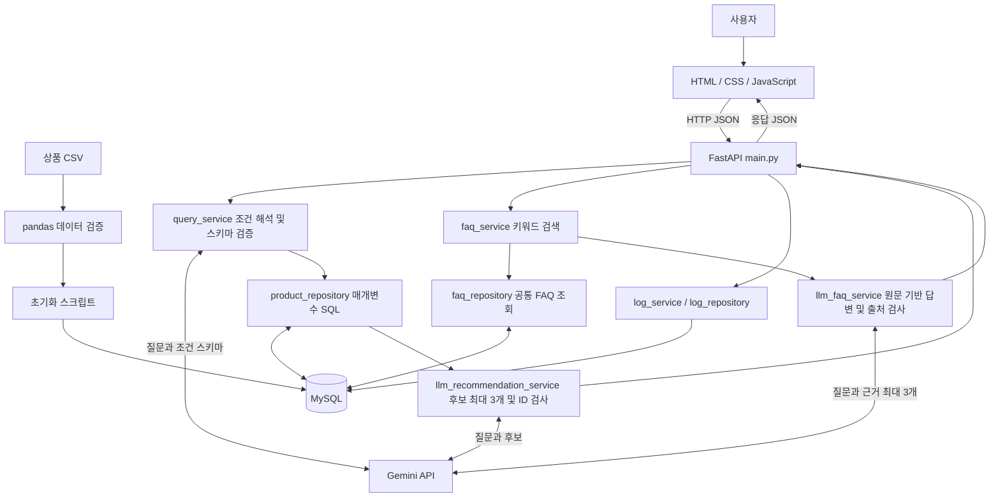

# 시스템 구조

현재 구현 기준: 로컬 FastAPI 단일 서비스, MySQL, 외부 Gemini REST API. HTML/CSS/JavaScript는 FastAPI가 제공합니다. API 키와 DB 비밀번호는 서버의 `.env`에서 읽습니다.

## 상품 요청 순서

1. 브라우저가 `POST /api/recommendations`로 질문을 보냅니다.
2. Pydantic이 공백 제거 후 길이와 타입을 검사합니다.
3. Gemini가 검색 조건 JSON을 만들고 `SearchIntent`가 필드 타입·값 범위·상충 조건을 검사합니다. SQL은 AI가 작성하지 않습니다.
4. 미지원·모호한 조건이면 검색을 중단합니다. 지원 조건은 `search_products()`에 전달합니다.
5. MySQL에서 활성 상품을 조건과 정렬에 맞게 조회합니다. 값은 `%s`로 바인딩하고 정렬 구문은 허용 목록에서 선택합니다.
6. 앞 3개의 후보에만 설명을 요청합니다. 반환 ID가 후보와 정확히 일치하는지 검사하고 DB 상품 정보에 설명만 추가합니다.
7. 응답을 준비하고 `finally`에서 요청 로그 저장을 시도합니다. 전체 검색 결과는 유지합니다.

## FAQ 요청 순서

`POST /api/faq/search → 활성 공통 FAQ 조회 → 질문과 키워드 정규화·점수 계산 → 최대 3개 원문 → LLM 답변 → 출처 ID 검사 → 원문과 답변 반환`

검색 결과가 없거나 최상위 점수가 같으면 생성 호출을 생략합니다. 모델이 근거 부족을 표시하면 답변을 보류합니다. 키워드 점수는 확률이나 AI 신뢰도가 아닙니다.

## 장애 경계와 설정

- 조건 해석 실패: 문장 전체를 인식할 수 있는 제한된 단순 규칙만 적용. 복잡한 조건을 무시하고 전체 상품을 반환하지 않습니다.
- 이유 생성 실패: DB 상품 결과만 유지. FAQ 생성 실패: 검색 원문 유지.
- LLM 503: 1초 뒤 1회 재시도. 다른 오류는 재시도하지 않습니다.
- DB 검색 실패: HTTP 503. 로그 쓰기 실패: 콘솔 오류 기록 후 기존 응답 유지.
- 전역 스위치 `LLM_ENABLED`, 조건 해석 `LLM_QUERY_ENABLED`, FAQ 생성 `LLM_FAQ_ENABLED`를 사용합니다.
- 상품 모델은 `LLM_MODEL`, FAQ는 `LLM_FAQ_MODEL`로 선택합니다. FAQ 설정을 생략하면 공통 모델을 사용합니다.

상품/FAQ ID 검사는 생성 문장 전체의 의미를 검증하는 장치는 아닙니다. 개인화 추천 모델, 벡터 검색, 비동기 작업 큐, 사용자 인증, 운영 배포는 구현 범위 밖입니다.
