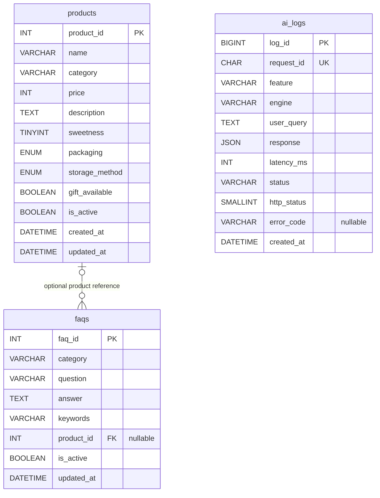

# MySQL ERD

아래 Mermaid 도식은 GitHub Markdown에서 표시됩니다. 실제 정의는 [products](../sql/schema.sql), [faqs](../sql/create_faqs.sql), [ai_logs](../sql/create_ai_logs.sql)를 기준으로 합니다.

## 테이블 역할과 관계

| 테이블 | 역할 | 주요 규칙 |
| --- | --- | --- |
| products | 가상 상품 30개 | 상품 ID 기본키, 당도 1~5 CHECK, 활성 상품만 검색 |
| faqs | 가상 공통 FAQ 10개 | 상품 ID 선택적 외래키. NULL이면 공통 FAQ |
| ai_logs | 요청별 처리 결과 | 자동 증가 log_id, 고유 request_id, 응답 JSON 저장 |

상품 하나는 FAQ 여러 개와 연결될 수 있고, FAQ는 상품 하나 또는 어떤 상품과도 연결되지 않을 수 있습니다. 현재 데이터는 모두 공통 FAQ이며 실제 검색도 `product_id IS NULL`로 제한합니다.

`ai_logs`는 상품과 외래키로 연결하지 않습니다. 한 응답에 여러 상품이 포함될 수 있고, 검색 결과가 없거나 실패한 요청도 기록해야 하기 때문입니다. 해당 시점의 응답 JSON에 상품/출처 ID가 남습니다.

## 필드와 시간 기준

- 가격은 원 단위 정수, 포장은 `individual` 또는 `bulk`, 보관은 `room`, `refrigerated`, `frozen`입니다.
- BOOLEAN은 MySQL에서 0/1로 저장하며 상품 API의 선물 여부는 Python bool로 변환합니다.
- 상품의 생성/수정 시간과 FAQ 수정 시간은 MySQL 기본 시간 설정을 따릅니다.
- 로그 `created_at`은 애플리케이션이 UTC로 작성합니다. 시간 조회 시 서로 다른 기준을 혼동하지 않습니다.
- 로그 `latency_ms`는 로그 쓰기 및 네트워크 시간을 제외합니다. `created_at` 인덱스를 둡니다.
- 로그의 `engine`은 호출 여부를 나타내며 개별 모델·토큰·재시도 정보는 `response` JSON에 저장합니다.

현재 모델은 작은 데모 데이터에 맞춘 구조입니다. 키워드 정규화 테이블, 사용자 테이블, 주문·결제 테이블은 포함하지 않습니다.
